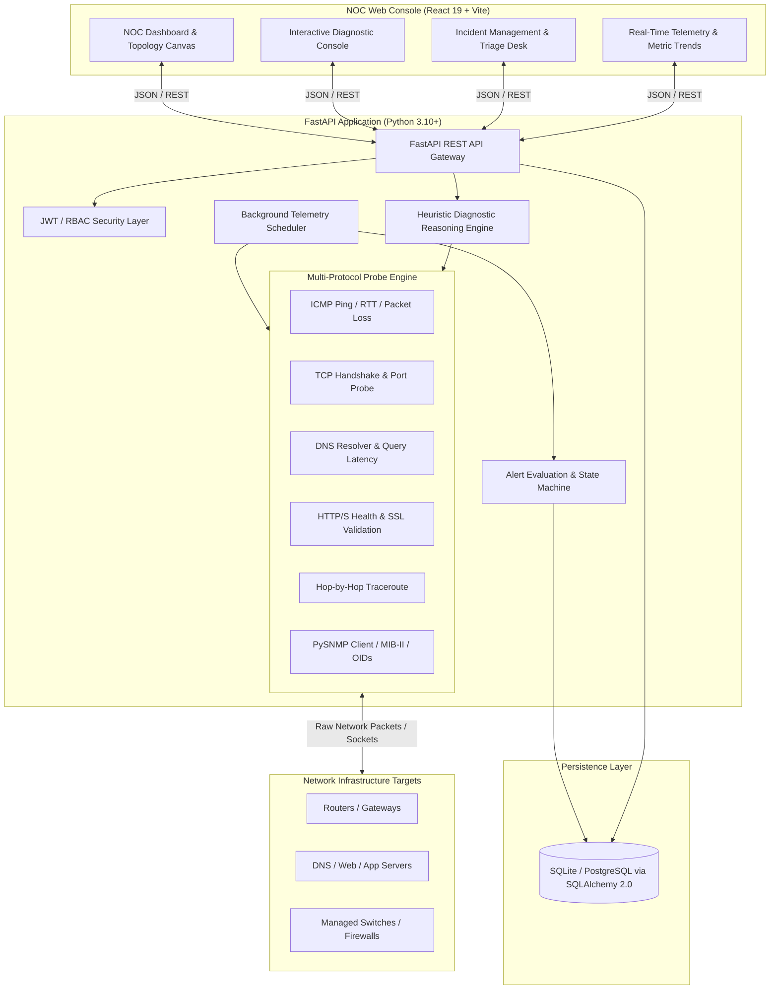

# NetOpsWatch - Network Operations Monitoring & Troubleshooting Platform

[](https://www.python.org/)
[](https://fastapi.tiangolo.com/)
[](https://react.dev/)
[](https://vitejs.dev/)
[](https://www.sqlalchemy.org/)
[](https://github.com/lextudio/pysnmp)
[-brightgreen.svg)](https://pytest.org/)
[](LICENSE)

> **Enterprise-Grade Network Operations Center (NOC) Monitoring, Multi-Protocol Diagnostics & Incident Management Platform.**

NetOpsWatch is a full-stack, production-ready network operations tool engineered to bridge network engineering fundamentals (TCP/IP stack, ICMP, DNS, TCP handshakes, HTTP/S, Traceroute, SNMP MIB-II) with modern cloud/SRE observability and software design patterns.

---

## Table of Contents

- [System Architecture](#-system-architecture)
- [Core Features & Technical Depth](#-core-features--technical-depth)
- [Diagnostic Reasoning Engine](#-diagnostic-reasoning-engine)
- [Tech Stack](#-tech-stack)
- [Project Directory Structure](#-project-directory-structure)
- [Getting Started](#-getting-started)
  - [Prerequisites](#prerequisites)
  - [Backend Setup](#1-backend-setup)
  - [Frontend Setup](#2-frontend-setup)
- [Demo Credentials](#-demo-credentials)
- [REST API Reference](#-rest-api-reference)
- [Running Automated Tests](#-running-automated-tests)
- [Interview & Resume Discussion Guide](#-interview--resume-discussion-guide)
- [License](#-license)

---

## System Architecture

NetOpsWatch uses a clean service-repository pattern with decoupled background telemetry collection, asynchronous I/O, and a glassmorphic NOC frontend.



---

## Core Features & Technical Depth

### 1. Real Multi-Protocol Network Probing Engine
*No mocked data* — the platform executes live networking system calls and socket operations:
- **ICMP Ping**: Computes minimum, maximum, and average Round-Trip Time (RTT), along with packet loss percentage and jitter across configurable multi-packet burst transmissions.
- **TCP Three-Way Handshake**: Measures socket establishment latency (`SYN` -> `SYN-ACK` -> `ACK`), accurately discerning between **open**, **closed (connection refused / RST packet)**, and **filtered (timeout / DROP rule)** states.
- **DNS Hierarchy Inspection**: Queries record types (`A`, `AAAA`, `CNAME`, `MX`, `NS`, `PTR`, `TXT`) using explicit nameservers with resolution latency tracking.
- **HTTP/HTTPS Service Assurance**: Validates response status codes, redirect chains, response sizes, latency breakdown, and SSL certificate handshake status.
- **Multi-Hop Traceroute**: Discovers layer-3 network routing paths, per-hop latency, and routing anomalies.
- **SNMP v2c / v3 Telemetry**: Walks standard MIB-II trees (`sysDescr`, `sysUpTime`, `ifTable`, `ifInOctets`, `ifOutOctets`, CPU/Memory metrics) using PySNMP 7.x.

### 2. Autonomous Background Polling Worker
- Powered by `APScheduler` running alongside FastAPI.
- Configurable polling intervals per device (default 30s) executing scheduled health checks without blocking incoming REST requests.
- Automatic metric retention for historical charting and degradation analysis.

### 3. Threshold-Based Alerting & Incident Lifecycle State Machine
- Continuous evaluation against SLA thresholds (RTT, packet loss, consecutive probe failures, service downtime).
- **Incident Lifecycle**:
  $$\text{OPEN} \xrightarrow{\text{Acknowledge}} \text{ACKNOWLEDGED} \xrightarrow{\text{Root Cause Mitigation}} \text{RESOLVED}$$
- Prevents alert storms with deduplication and incident suppression until resolution.
- Audit trail recording who acknowledged, timestamped diagnostic logs, and resolution notes.

### 4. Interactive NOC Dashboard & Topology Visualizer
- Real-time device health status indicators (Operational, Degraded, Critical, Unreachable).
- Visual Layer-3 topology map showing relationships between core routers, firewalls, and application servers.
- Dark-mode glassmorphic NOC theme with high-contrast status badges, latency sparklines, and metric cards.

---

## Diagnostic Reasoning Engine

One of the flagship features of NetOpsWatch is its **Heuristic Diagnostic Reasoning Engine** (`backend/app/networking/diagnostic_engine.py`). Rather than leaving raw numbers to human interpretation, the engine tests multiple layers simultaneously and applies deterministic network triage heuristics:

| Diagnostic Finding | Underlying Network Reality | Suggested NOC Remediation |
| :--- | :--- | :--- |
| **DNS Resolution Failed + ICMP Skipped** | Nameserver unreachable or domain record absent | Check upstream resolver, `/etc/resolv.conf`, or registrar DNS zone |
| **DNS OK + ICMP OK + TCP Port Open + HTTP 500/502** | Network path is healthy; application process/reverse proxy is malfunctioning | Inspect backend web service daemon, Nginx/HAProxy logs, or container health |
| **DNS OK + ICMP OK + TCP Connection Refused (RST)** | Host is alive, but no daemon is listening on destination port | Verify daemon status (`systemctl status`), verify bind IP (`0.0.0.0` vs `127.0.0.1`) |
| **DNS OK + ICMP OK + TCP Timeout** | Packet silently dropped along network path | Check firewall rules (`iptables`, `nftables`, AWS Security Group, ACL) |
| **DNS OK + ICMP 100% Loss + TCP Port Open** | Target or intermediate edge device drops ICMP Echo Requests | Host is online; ICMP is administratively disabled/rate-limited |
| **High RTT + High Jitter + TCP Latency Spike** | Saturated uplink, bufferbloat, or wireless packet retransmission | Check interface line utilization, QoS queue drops, duplex mismatch |

---

## Tech Stack

### Backend
- **Language**: Python 3.10+
- **Web Framework**: [FastAPI](https://fastapi.tiangolo.com/) (Async ASGI, OpenAPI documentation)
- **Database & ORM**: [SQLAlchemy 2.0](https://www.sqlalchemy.org/) with SQLite (development) & PostgreSQL support
- **Network Probing**:
  - Raw Ping: `ping3`
  - DNS Inspection: `dnspython`
  - HTTP Probing: `httpx` (async client)
  - SNMP Polling: `pysnmp` 7.1+
  - Socket Engine: Standard library `socket` & `asyncio`
- **Scheduler**: `APScheduler`
- **Authentication**: JWT (`python-jose`) + `passlib[bcrypt]`

### Frontend
- **Framework**: [React 19](https://react.dev/) + [Vite 8](https://vitejs.dev/)
- **Icons**: [Lucide React](https://lucide.dev/)
- **Styling**: Pure modern CSS3 Design System (Glassmorphism, CSS Variables, Flexbox/Grid, Responsive)
- **State & Networking**: Native Fetch API with bearer token interceptor and resilient polling

---

## Project Directory Structure

```text
d:\Network\
├── README.md                      # Project documentation & operational handbook
├── netopswatch.db                 # SQLite database with initial NOC inventory & telemetry
│
├── backend/                       # FastAPI Backend Service
│   ├── requirements.txt           # Python dependencies (Pinned)
│   ├── app/
│   │   ├── main.py                # ASGI application entrypoint & lifecycle events
│   │   ├── core/                  # Configuration, security, password hashing, JWT
│   │   ├── database/              # SQLAlchemy engine, base session, seed routines
│   │   ├── models/                # Database models (Devices, Services, Metrics, Alerts, Incidents, Users)
│   │   ├── schemas/               # Pydantic validation schemas (V2 ConfigDict)
│   │   ├── networking/            # Low-level network probe & diagnostic engines
│   │   │   ├── ping.py            # ICMP multi-packet ping & jitter calculator
│   │   │   ├── tcp_probe.py       # TCP 3-way handshake & port status prober
│   │   │   ├── dns_probe.py       # DNS resolver & record query engine
│   │   │   ├── http_probe.py      # HTTP/HTTPS health & latency analyzer
│   │   │   ├── traceroute.py      # Layer-3 hop discovery & RTT prober
│   │   │   ├── snmp_client.py     # PySNMP MIB-II walker & telemetry extractor
│   │   │   └── diagnostic_engine.py # Heuristic multi-layer root cause engine
│   │   ├── services/              # Business logic & repository handlers
│   │   ├── api/v1/                # REST API routers
│   │   │   ├── auth.py            # Authentication, login, user info
│   │   │   ├── devices.py         # Device inventory management
│   │   │   ├── diagnostics.py     # Real-time probe execution & diagnostic engine
│   │   │   ├── telemetry.py       # Metrics & time-series data
│   │   │   ├── alerts.py          # Alert rules & active alerts
│   │   │   ├── incidents.py       # Incident desk & triage workflow
│   │   │   └── users.py           # User management (Admin only)
│   │   └── workers/
│   │       └── scheduler.py       # Autonomous background telemetry polling daemon
│   └── tests/                     # Automated unit & integration tests
│       ├── test_networking.py     # Network probe test suite
│       └── test_api.py            # API endpoint & RBAC test suite
│
└── frontend/                      # React 19 Frontend Console
    ├── index.html                 # HTML shell
    ├── package.json               # Frontend dependencies & build scripts
    ├── vite.config.js             # Vite bundler configuration
    └── src/
        ├── main.jsx               # Application root bootstrap
        ├── App.jsx                # Layout, navigation, active view router
        ├── index.css              # NOC Glassmorphism design system & variables
        ├── api.js                 # Unified API client & authorization bearer injection
        ├── context/
        │   └── AuthContext.jsx    # Session management & user state
        └── components/
            ├── Navbar.jsx         # Top navigation, status indicator, user menu
            ├── Dashboard.jsx      # Executive NOC overview & summary metrics
            ├── DeviceInventory.jsx# Device list, add/edit/delete, status filters
            ├── DeviceDetailModal.jsx # Deep-dive telemetry, services, & device metrics
            ├── DiagnosticConsole.jsx# On-demand probe suite (Ping, TCP, DNS, HTTP, Trace, SNMP, Full Diagnostic)
            ├── AlertCenter.jsx    # Active alerts, severity filters, rule configuration
            ├── IncidentDesk.jsx   # Incident triage, acknowledge, notes, resolution
            ├── NetworkTopology.jsx# Visual interactive layer-3 topology canvas
            └── LoginModal.jsx     # Modern NOC authentication modal
```

---

## Getting Started

### Prerequisites
- **Python 3.10+**
- **Node.js 18+** & **npm**
- **Git**
- *Windows Note*: ICMP raw socket pinging or traceroute operates using native sockets. Run PowerShell / Terminal with standard user or Administrator privileges as required by your local security policy.

---

### 1. Backend Setup

1. **Navigate to the backend directory and activate virtual environment**:
   ```powershell
   # Windows PowerShell
   cd d:\Network
   python -m venv venv
   .\venv\Scripts\Activate.ps1
   cd backend
   ```

   ```bash
   # Linux / macOS
   cd d:/Network
   python3 -m venv venv
   source venv/bin/activate
   cd backend
   ```

2. **Install dependencies**:
   ```bash
   pip install -r requirements.txt
   ```

3. **Initialize Database and Seed Initial Inventory**:
   ```bash
   # Runs automatic seed: default users (admin, operator, viewer) & initial network inventory
   python -c "from app.database.session import init_db; from app.database.seed import seed_data; init_db(); seed_data()"
   ```

4. **Start the FastAPI Development Server**:
   ```bash
   python -m uvicorn app.main:app --host 127.0.0.1 --port 8000 --reload
   ```

The backend is now live at `http://127.0.0.1:8000`.  
Explore the interactive Swagger API documentation at: **`http://127.0.0.1:8000/docs`**.

---

### 2. Frontend Setup

1. **Open a new terminal, navigate to the frontend directory**:
   ```powershell
   cd d:\Network\frontend
   ```

2. **Install Node dependencies**:
   ```bash
   npm install
   ```

3. **Launch Vite Development Server**:
   ```bash
   npm run dev
   ```

4. **Access the NOC Web Console**:
   Open your browser and navigate to **`http://127.0.0.1:5173/`**.

---

## Demo Credentials

The platform comes pre-seeded with three Role-Based Access Control (RBAC) tiers:

| Username | Password | Role | Permissions |
| :--- | :--- | :--- | :--- |
| **`admin`** | `Admin@NetOps123` | **Admin** | Full access: device provisioning, delete, acknowledge/resolve incidents, user management |
| **`operator1`** | `Operator@NetOps123` | **Operator** | Operational access: run diagnostic tools, acknowledge & add notes to incidents |
| **`viewer1`** | `Viewer@NetOps123` | **Viewer** | Read-only view: monitoring dashboard, telemetry graphs, active alerts |

---

## REST API Reference

NetOpsWatch exposes a fully documented, type-safe REST API:

### Authentication (`/api/v1/auth`)
- `POST /api/v1/auth/token` - OAuth2 password bearer token exchange.
- `GET /api/v1/auth/me` - Fetch authenticated user profile and roles.

### Devices (`/api/v1/devices`)
- `GET /api/v1/devices` - List all monitored infrastructure with status filters and search.
- `POST /api/v1/devices` - Provision a new network device.
- `GET /api/v1/devices/{id}` - Retrieve device configuration and interface metadata.
- `PUT /api/v1/devices/{id}` - Update device properties (IP, SNMP community, polling interval).
- `DELETE /api/v1/devices/{id}` - Remove device from inventory.

### Diagnostics & Probing (`/api/v1/diagnostics`)
- `POST /api/v1/diagnostics/ping` - Trigger ICMP ping burst (RTT, packet loss, jitter).
- `POST /api/v1/diagnostics/tcp` - Execute TCP 3-way handshake probe against specific port.
- `POST /api/v1/diagnostics/dns` - Query DNS record sets (`A`, `AAAA`, `MX`, etc.) with timing.
- `POST /api/v1/diagnostics/http` - Execute HTTP/S health and status check.
- `POST /api/v1/diagnostics/traceroute` - Run hop-by-hop layer-3 route trace.
- `POST /api/v1/diagnostics/snmp` - Perform SNMP MIB-II system walk.
- `POST /api/v1/diagnostics/run-full` - Run complete multi-protocol diagnostic reasoning engine.

### Telemetry & Metrics (`/api/v1/telemetry`)
- `GET /api/v1/telemetry/device/{device_id}` - Fetch historical telemetry time-series.
- `GET /api/v1/telemetry/summary` - Aggregate metrics across entire infrastructure.

### Alerts & Incidents (`/api/v1/alerts`, `/api/v1/incidents`)
- `GET /api/v1/alerts` - List active and historical threshold alerts.
- `POST /api/v1/alerts/evaluate` - Force immediate threshold evaluation.
- `GET /api/v1/incidents` - List incidents with status filter (`OPEN`, `ACKNOWLEDGED`, `RESOLVED`).
- `PUT /api/v1/incidents/{id}/acknowledge` - Triage and assign incident to operator.
- `PUT /api/v1/incidents/{id}/resolve` - Resolve incident with root cause documentation.

---

## Running Automated Tests

NetOpsWatch includes extensive test coverage across network probing logic and REST API routes:

```powershell
# Activate virtual environment
cd d:\Network
.\venv\Scripts\Activate.ps1

# Run full test suite with verbose output
python -m pytest backend/tests -v
```

### Test Suite Structure:
- **`backend/tests/test_networking.py`**:
  - `test_icmp_ping_local`: Tests ICMP ping to loopback interface.
  - `test_tcp_probe_open_and_closed`: Verifies open port vs connection refused handling.
  - `test_dns_probe`: Tests standard DNS A record resolution.
  - `test_http_probe`: Tests HTTP request execution and response parsing.
  - `test_snmp_client_initialization`: Verifies PySNMP client configuration.
  - `test_diagnostic_engine_offline_target`: Tests heuristic decision-making on unreachable hosts.
- **`backend/tests/test_api.py`**:
  - `test_health_check`: Verifies API gateway health.
  - `test_auth_flow`: Tests JWT token generation and authentication rejection on bad credentials.
  - `test_device_crud`: Tests full lifecycle of device inventory management.
  - `test_diagnostics_endpoints`: Tests live execution of API diagnostic probe endpoints.
  - `test_alerts_and_incidents`: Tests alert generation and incident acknowledgment/resolution workflow.


## License

This project is licensed under the MIT License — see the [LICENSE](LICENSE) file for details.
